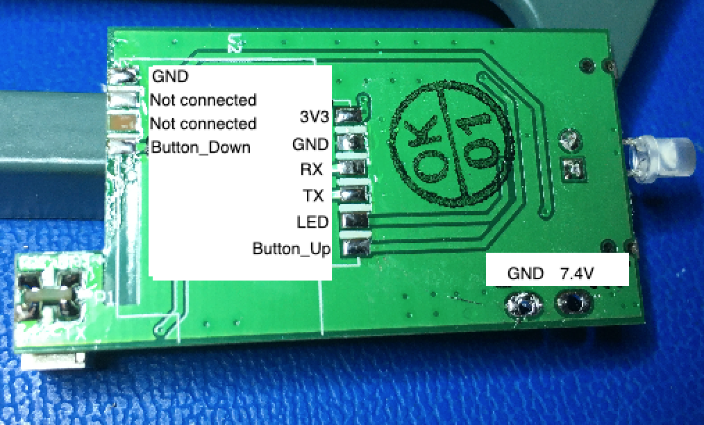

# IKEA Fyrtur roller blind WiFi module firmware

## Introduction

This is a firmware for custom ESP32 / ESP8266 based WiFi module that can be used to control IKEA Fyrtur and Kadrilj roller blinds.

First, why would one want to re-invent the wheel and replace the Ikea wireless module?

* Avoid finicky Zigbee pairing operation (first pair the remote with the hub, then with the signal repeater, then with the blinds and hope that everything turns out fine.. which hasn't been my experience with the Ikea Trådfri and Home Smart app)
* Avoid unstable Zigbee normal mode operation (sometimes the blinds would go to deep sleep and would not wake up until manually woken up with a button press on the blinds. Also, the latency can vary from tolerable to awful)
* MQTT and Home Assistant support including MQTT auto-discovery functionality for automatic detection of Fyrtur nodes
* Enable the use of blinds longer than 195cm!
* Possibility to integrate temperature/humidity sensors or maybe a window break-in sensor?

There also exists [a custom firmware for the Fyrtur motor module](https://github.com/mjuhanne/fyrtur-motor-board) that makes it possible to have more finer control of the motor unit along with several enhancements:

 * **Allow setting custom motor speed.** The full speed with original FW is a bit too noisy for my ears, especially when used to control morning sunlight in the bedroom. Now it's possible to set the speed to 3 RPM and enjoy the completely silent operation, waking up to the sunlight instead of whirring noise :)
 * **Allow the use of "front roll" configuration (curtain rod flipped 180 degrees) to give 2-3cm space between window and the blinds
 * **Enable the use of 5-6 volt DC source.** Original firmware was intended to be used with rechargeable battery which was protected from under-voltage by ceasing operation when voltage drops below 6 VDC. Conversely it is recommended that our custom firmware is used with the ESP WiFi module plugged to DC adapter. In this case the low voltage limit for motor operation can be ignored, mitigating the need to shop for the harder-to-get 6-7.5 volt adapters. The minimum operating voltage check can be enabled though if one wants to use this with the original Zigbee module with battery.
 * **Smoother movement.** The blinds accelerate and decelerate more smoothly than with original FW
 * **More stable position handling.** Original firmware starts losing its position gradually if it isn't calibrated every now and then by rolling the blinds to up-most position. The custom firmware retains its position much better in the long run.
 * **Finer curtain position handling.** Original firmware has 1% granularity for the curtain position (0% - 100%). This translates to 1.5 cm resolution when using blinds with 1.5m tall window. It doesn't sound much, but when using sunlight-blocking curtain a lot of sunlight can seep between lower curtain and window board from a 0.5-1.5 cm gap. The custom firmware allows setting target position with sub-percent resolution so curtain can be lowered more accurately.  

For more information about the custom firmware and the motor board itself (including reverse engineered schematics), please see the [motor module page](https://github.com/mjuhanne/fyrtur-motor-board).

## Wiring

There are many ways one can install the module. Probably the easiest way is to modify the original main board:
 * Unsolder the battery power wiring and replace it with a connector with your own liking. A DC adapter has to be used since MQTT connection and sleep mode don't go so well together and the original battery will be soon empty. If using [custom Fyrtur motor module firmware](https://github.com/mjuhanne/fyrtur-motor-board) a 5 volt DC adapter can be used, otherwise the minimum operating voltage is around 6-6.5V.
 * Unsolder the Zigbee module. This can be achieved with a broad solder tip or with a desoldering station / hot air rework station. Care has to be taken not to inadvertently lift off the pads! (And avoid what happened below with the 3rd pad on the right)

 

#### Custom PCB 

There is also a [custom PCB](https://github.com/mjuhanne/ikea-fyrtur) that replaces the original Fyrtur main board. It's been designed to hold ESP12F (ESP8266 PCB module) along with the usual reset paraphernalia. Alternatively one can use it as an interface board. In the latter case a separate ESP32 or ESP8266 module (DevkitC for example) can be connected to the motor, LED and buttons via the interface board.

 


## Installation

In the current state **it is recommended to use ESP32** since ESP8266 might not have enough memory to handle all the operation scenarios (especially when WiFi/MQTT manager Access Point is up) and its behaviour can be thus erratic at times. This might change in the future if the memory usage can be optimized significantly.

#### SDK 
Install the ESP32 SDK (esp-idf) by following the steps on the [installation page](https://docs.espressif.com/projects/esp-idf/en/latest/esp32/get-started/index.html). Make sure you can build and deploy an example project before continuing further

#### Compiling and deployment
Install the *fyrtur-esp* main program and its dependencies. The required components are shared by other home automation/ESP projects as well, so please create a directory layout like below.
```
mkdir iot
cd iot
git clone https://github.com/mjuhanne/fyrtur-esp.git
mkdir components
cd components
git clone https://github.com/mjuhanne/node-framework.git
git clone https://github.com/mjuhanne/esp-wifi-manager.git
git clone https://github.com/mjuhanne/esp-si7021.git
```
Chdir to *fyrtur-esp* directory and build the application (use default menuconfig settings). Then deploy the application while monitoring the debug console for any possible errors.
```
idf.py menuconfig
idf.py app
idf.py -p /dev/tty.SLAB_USBtoUART flash monitor
```
The port may vary depending on the operating system and the ESP32 variant you have.

#### Configuration
Fyrtur module will create an Access Point with a custom web portal which can be used to configure the home network WiFi AP well as the MQTT server. The AP name is "Fyrtur-xxxxxx", where xxxxxx is the last 6 digits of ESP32 WiFi module MAC address. This variation is done because we want to distinguish one Fyrtur node from another. Password to the AP is by default 'esp32pwd' but that can be configured via menuconfig. 
Connect to the AP and access http server at *10.10.0.1*. Use the interface to first connect to the target Access Point and then configure the MQTT server.
The Fyrtur Access Point will shutdown after 1 minute of successful configuration. AP can be restarted via MQTT interface, pressing UP and DOWN buttons for > 2 seconds, or by doing factory reset (see below).


## Usage

When first powered, the motor module does not know the current curtain position, so curtains are calibrated by rolling them up until motor starts stalling. 
Fyrtur curtains can then be controlled manually by using the buttons or via MQTT protocol. Button interface is usable even when the module is not yet configured and/or the wireless link to home automation is down. 

### Button interface

* UP/DOWN BUTTONS:  
		Single click: Starts rolling blinds up/down if they are stopped. Otherwise stops movement.  LED will blink once.
		Double click: 
			- Set lower curtain limit to the current position (curtains must be stopped first). LED will blink twice.
			- If curtains are at top position, lower curtain limit will be reset to the full length. LED will blink three times.

* UP or DOWN BUTTON held down for 1 second: Continous slow movement up/down overriding the previously set max/full curtain length limits.
		- Setting the custom speed is not possible in original motor firmware. Movement will be done in small steps instead.

* BOTH buttons held down:
	* 2000 milliseconds : restart Wireless Access point
	* 3500 ms : led starts blinking, warning about imminent factory reset
	* 6000 ms : do a factory reset:
			- LED will stay on
			- ESP's Non-volatile memory is formatted so variables are reset to default values (WiFI and MQTT server settings are removed)
			- Fyrtur motor module variables are also reset to default values
			- User defined (maximum) curtain length is reset to full length and curtains will start calibration procedure by rolling them up
			- If FULL curtain length has been modified, it will also be reseted to the original value (13 revolutions + 265 degrees) if motor module has a custom firmware installed. Note that with original firmware this cannot be done in software but curtains will have to be rolled to correct position with overriding move commands manually and then *set_full_len* command be executed either via MQTT interface or via console.
			- ESP module is reset
			- Wireless Access Point is restarted in order to re-configure WiFi AP and MQTT server

### LED signaling
- no blinking: in standby
- 1000ms on and off: WiFi/MQTT needs configuration (please connect to Fyrtur AP)
- 2 short blinks repeating: Connecting to AP, or WiFI is in disconnected state
- 3 short blinks repeating: Connecting to MQTT server, or in disconnected state
- 2 sec blink: MQTT connected
- On: OTA update process started
- 5 short blinks repeated 3 times: OTA update failed

### MQTT interface

(In the examples below "fyrtur-e975c1" is just a sample node name)

#### Curtain position
*Fyrtur-esp* will publish curtain position with an outgoing MQTT topic:

`/home/cover/fyrtur-e975c1/position`
	- Payload: curtain position (0 = closed, 1000 = open)
	
#### Remote control
*Fyrtur-esp* supports controlling the curtain with following incoming MQTT topics:

- `/home/control/fyrtur-e975c1/command`
	- Payload: OPEN / CLOSE / STOP
	- OPEN and CLOSE commands respects the (maximum) curtain length and thus stops when upper/lower limit is reached.
- `/home/control/fyrtur-e975c1/set/target_position`
	- Payload: Number between 0 (closed) and 1000 (open)
	- Lower/raise the curtain to the desired position
- `/home/control/fyrtur-e975c1/force_move_up`
- `/home/control/fyrtur-e975c1/force_move_down`
	- Payload: Number of curtain rod revolutions to move
	- Force movement outside the (maximum or full) curtain length.
- `/home/control/fyrtur-e975c1/reset`
	- Reset the current (user defined) maximum curtain length to full (factory defined) curtain length and start calibration process by rewinding curtains to topmost position.
- `/home/control/fyrtur-e975c1/set/max_len`
	- Set the maximum (user defined) curtain length to current position
- `/home/control/fyrtur-e975c1/set/full_len`
	- Set the full (factory defined) curtain length to current position. 

For more information about the maximum/full curtain lenghts and curtain position calibration, the best source is currently the [custom Fyrtur motor module firmware documentation](https://github.com/mjuhanne/fyrtur-motor-board) 

Other MQTT remote control topics:

- `/home/control/fyrtur-e975c1/start_ap`
	- restarts the WiFi Manager Access Point. Note that AP auto_shutdown is disabled so AP stays on until stopped
- `/home/control/fyrtur-e975c1/stop_ap`
	- stops the WiFi Manager Access Point
- `/home/control/fyrtur-e975c1/restart`
	- ESP module software reset


#### Node configuration via MQTT
*Fyrtur-esp* supports also configuring additional settings. These will be stored into the non-volatile EEPROM/FLASH of either ESP32/8266 or the STM32 based motor module.

- `/home/control/fyrtur-e975c1/set/name`
	- Payload: new node name
	- *Fyrtur-esp* will be renamed into the name specified in payload. Also node will subscribe to /home/node/[new_name]/# and /home/cover/[new_name]/ and use these new topics respectively
- `/home/control/fyrtur-e975c1/set/default_speed`
	- Payload: default motor speed in RPM (allowed values are between 2 and 25 RPM)
- `/home/control/fyrtur-e975c1/set/speed`
	- Payload: (temporary) motor speed in RPM
	- Note! In contrast to "default_speed" above, this setting will not be written to EEPROM/FLASH in order to protect it from too frequent writes. Consequently this command can be used to develop for example variable curtain speed functionality (e.g. faster speed for quick curtain rewinding followed by slower speed when approaching the endpoint)
- `/home/control/fyrtur-e975c1/set/minimum_voltage`
	- Payload: minimum operating voltage
	- The original Fyrtur module uses 7.4V battery which should be protected from under-voltage. The new module is intended to be supplied by 5-8 volt DC adapter so there's no need for battery protection anymore. The default setting is 0 (protection disabled). If needed, one can set the minimum operating voltage under which the motor will not be powered. **Note that this restriction will apply only to the DC motor, but not the STM32 chip inside motor module nor the ESP module!**
- `/home/control/fyrtur-e975c1/set/orientation`
	- Payload: 0 (normal/back roll configuration), 1 (reverse/front roll configuration)
	- If you want to flip the curtain rod 180 degrees to "front roll" configuration, you can use this command. It's best to first use this command to change the software setting before doing the actual physical flipping, or otherwise be prepared to stop the blinds' automatic calibration attempt during power up by pressing UP or DOWN button (blinds would be rotating in wrong direction without any constraints..)

#### Temperature and humidity sensor
If *Fyrtur-esp* detects the external SI7021 / HTU21D temperature and humidity sensor, it will broadcast its measurements with following topics:

- `/home/sensor/fyrtur-e975c1/temperature`
	- Payload: temperature in Celsius degrees
- `/home/sensor/fyrtur-e975c1/humidity`
	- Payload: relative humidity (0-100)

The default broadcast interval is 10 seconds. This can be configured with MQTT:

- `/home/control/fyrtur-e975c1/set/sensor_broadcast_interval`
	- Payload: interval in seconds (0 = broadcasting is disabled)

#### MQTT Discovery
Home Assistant supports [MQTT Discovery](https://www.home-assistant.io/docs/mqtt/discovery/), which facilitates the detection of the Fyrtur curtains without explicit configuration of each individual Fyrtur node. Note that MQTT Discovery has to be enabled first in Home Assistant configuration.
When connection to MQTT server is made, an announcement message is published that declares the node and its affiliated command and status MQTT topics. In the case of Fyrtur curtains, the Home Assistant integration we are using is [MQTT Cover](https://www.home-assistant.io/integrations/cover.mqtt/)  with a  device class (a component subtype)  *"blind"*. 

Example with a node name *"fyrtur-e975c1*":

```
/home/cover/fyrtur-e975c1/config
```
with JSON payload:
```
{    
	"name": "fyrtur-e975c1",
	"unique_id": "fyrtur-e975c1",
	"device_class": "blind",     
	"command_topic": "/home/control/fyrtur-e975c1/command",
	"position_topic": "/home/cover/fyrtur-e975c1/position",
	"set_position_topic": "/home/control/fyrtur-e975c1/set_position",
	"position_open": 1000
}
```

If SI7021 / HTU21D temperature and humidity sensor is detected it will be announced as well:

```
/home/sensor/fyrtur-e975c1/temperature/config
```
with JSON payload:
```
{    
	"name": "fyrtur-e975c1 temperature",
	"device_class": "temperature",
	"state_topic": "/home/sensor/fyrtur-e975c1/temperature"
}
```
and
```
/home/sensor/fyrtur-e975c1/humidity/config
```
with JSON payload:
```
{    
	"name": "fyrtur-e975c1 humidity",
	"device_class": "humidity",
	"state_topic": "/home/sensor/fyrtur-e975c1/humidity"
}
```

#### OTA update
The node-framework supports OTA updates via HTTP. The process is initiated with a MQTT topic:
- `/home/control/fyrtur-e975c1/update_firmware`
	- Payload: URL of the ESP firmware
	- Example: *"http://myfirmwareserver.local/esp/fyrtur.bin"*

When process is started, LED will stay on until OTA update is complete. The module is rebooted automatically after successful update. If OTA update failed, LED will blink 5 times quickly, repeated by 3 times.

Note that the OTA update procedure currently supports **only non-secure HTTP!** HTTPS support would require providing the Fyrtur module with at least a root certificate of a root certificate authority (a public one or one that you created yourself). Uploading the certificate could be done via Access point in configuration stage (this would need additional changes to the esp-wifi-manager). This same certificate could be used to enable SSL support for MQTT server as well.


